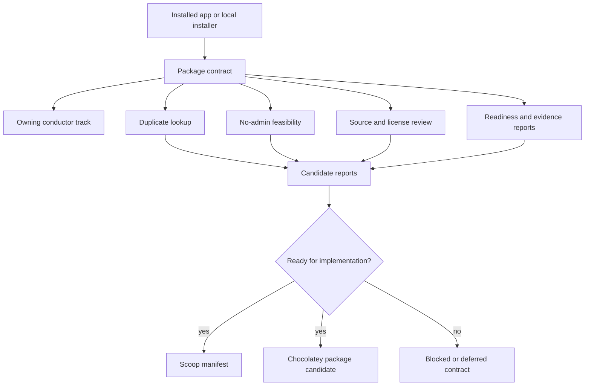
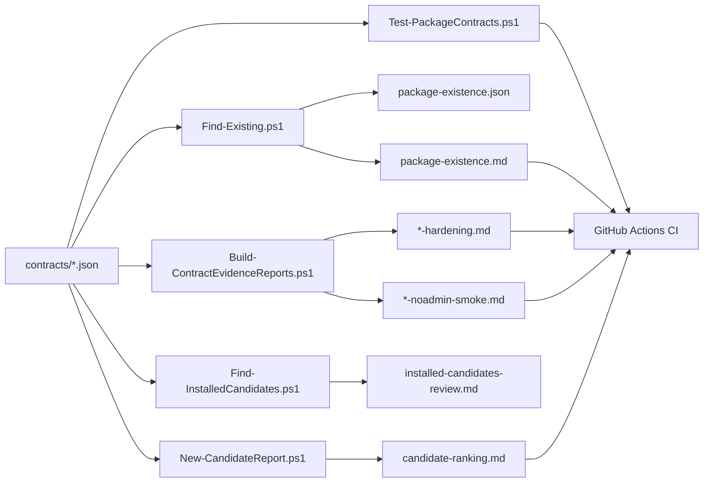
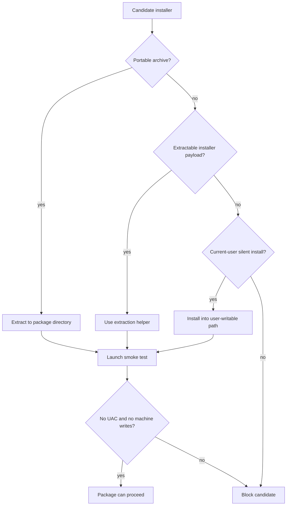
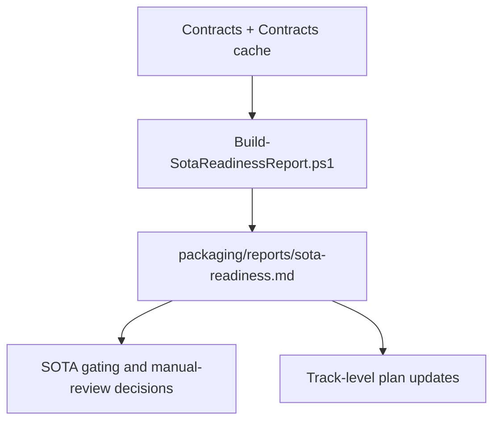
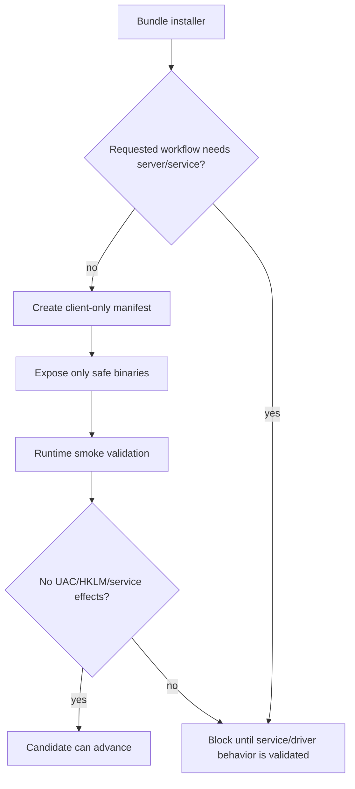
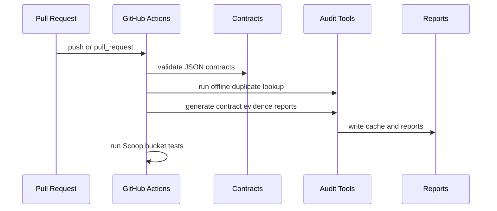
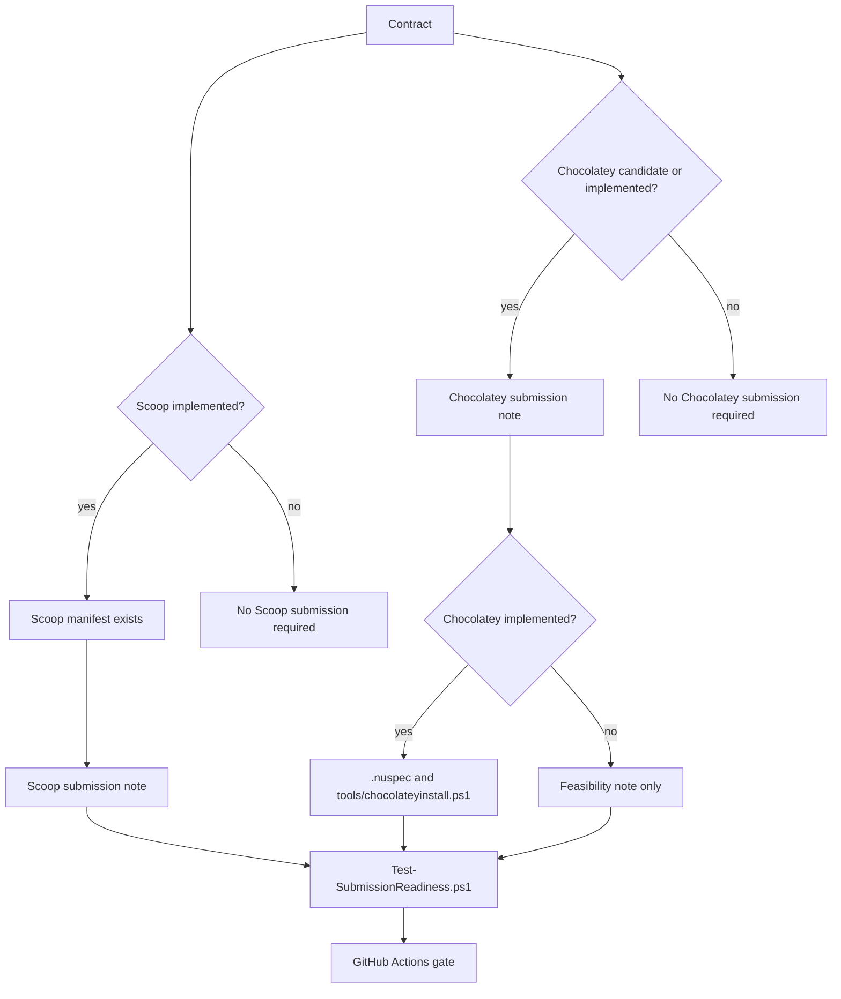
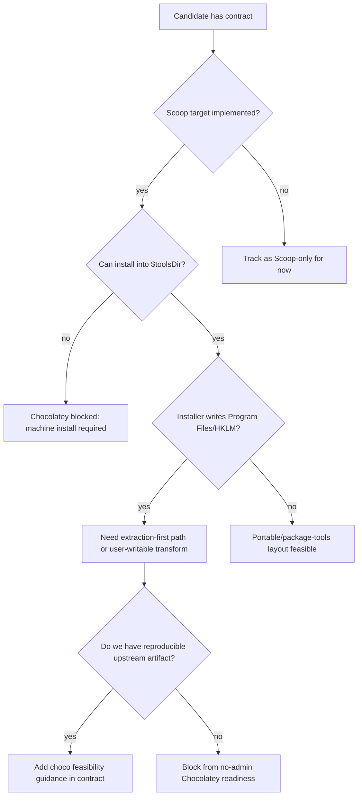

# No-Admin Package Factory Design

## Overview
The factory adds a contract-first workflow for package candidates. Contracts define the source, installer shape, no-admin strategy, duplicate lookup terms, and Scoop/Chocolatey target status before implementation starts.

## Data Flow
Contracts live under `packaging/contracts/`. The audit tools read those contracts, scan local Scoop buckets, optionally query package feeds, and write cache/report outputs.

## No-Admin Decision Tree
Package implementation starts only after the installer can be handled without elevation.

## Readiness Matrix

## Bundle Narrowing
When an upstream installer contains both client-only and service/server components, the factory narrows the package to the minimum binary set needed for the requested workflow.

## CI Contract
The CI path is offline-first. It validates contracts and regenerates reports without requiring Chocolatey or WinGet network access. Online lookup should run as a scheduled refresh once cache handling is stable.

## Submission Readiness

## Chocolatey No-Admin Flow

## Guardrails
- Contract validation is required before implementation.
- Duplicate lookup is required before implementation.
- Online lookup failures are warnings unless the candidate is being marked ready.
- Any elevation, machine-wide install, service, driver, HKLM write, or Program Files write blocks no-admin readiness.
- WebView2-dependent apps must use an existing user/fixed runtime strategy rather than machine bootstrapping.
- Implemented Chocolatey targets require concrete package-source files and static no-admin script checks; a Markdown submission note alone is not sufficient.
