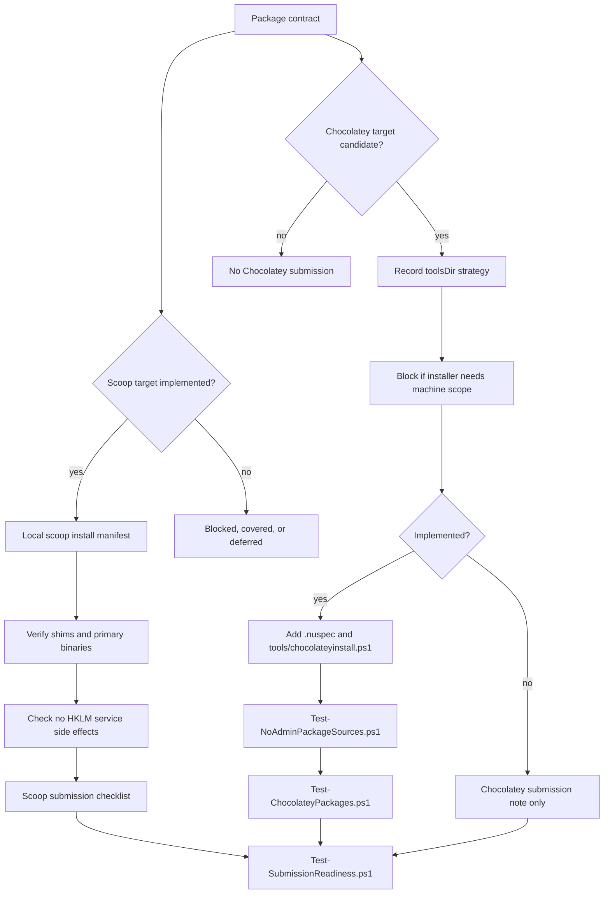

# No-Admin Submission Workflow

## Exit Criteria

- `tools/package-audit/Test-PackageContracts.ps1`
- `tools/package-audit/Test-SubmissionReadiness.ps1`
- `tools/package-audit/Test-NoAdminPackageSources.ps1`
- `tools/package-audit/Test-ChocolateyPackages.ps1`
- `tools/package-audit/Test-CiContracts.ps1`
- `bin/Package-Factory.Tests.ps1`
- `git diff --check`

Implemented Chocolatey targets additionally require `packaging/chocolatey/<package_id>/<package_id>.nuspec` and `packaging/chocolatey/<package_id>/tools/chocolateyinstall.ps1`. Static CI blocks admin helpers, machine-scope package installers, Program Files, HKLM, service, and driver patterns.

## Evidence Boundaries

Install/link/binary-presence validation is enough to call a Scoop manifest implemented when the manifest is extraction-first or installs into the user Scoop app directory. GUI launch and uninstall cleanup require explicit separate evidence before they can be described as passed.
